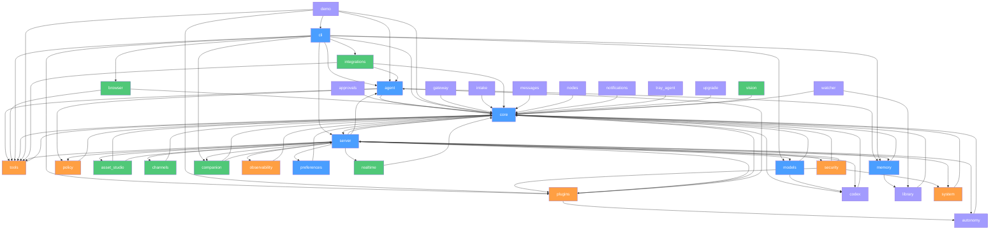

# Architecture Dependency Graph

```mermaid
graph TD
    agent --> core
    agent --> tools
    agent --> memory
    agent --> policy
    approvals --> core
    asset_studio --> core
    asset_studio --> server
    autonomy --> core
    browser --> core
    browser --> tools
    channels --> core
    cli --> core
    cli --> agent
    cli --> server
    cli --> tools
    cli --> memory
    cli --> models
    cli --> plugins
    cli --> browser
    cli --> companion
    cli --> integrations
    codex --> core
    companion --> core
    companion --> server
    core --> tools
    core --> codex
    core --> server
    demo --> core
    demo --> agent
    demo --> cli
    demo --> tools
    demo --> plugins
    gateway --> core
    intake --> core
    integrations --> core
    integrations --> agent
    integrations --> tools
    library --> core
    memory --> core
    memory --> library
    messages --> core
    models --> core
    models --> codex
    nodes --> core
    notifications --> core
    observability --> core
    plugins --> core
    plugins --> agent
    plugins --> autonomy
    policy --> core
    preferences --> core
    realtime --> core
    security --> core
    security --> server
    security --> plugins
    security --> system
    server --> core
    server --> agent
    server --> memory
    server --> models
    server --> preferences
    server --> tools
    server --> observability
    server --> policy
    server --> system
    server --> autonomy
    server --> realtime
    server --> security
    server --> plugins
    server --> asset_studio
    server --> codex
    server --> channels
    server --> companion
    system --> core
    tools --> core
    tray_agent --> core
    upgrade --> core
    vision --> core
    watcher --> core
    watcher --> library

    classDef core fill:#4a9eff,color:#fff
    classDef ext fill:#50c878,color:#fff
    classDef infra fill:#ff9f43,color:#fff
    classDef support fill:#a29bfe,color:#fff
    class agent,cli,core,memory,models,preferences,server core
    class asset_studio,browser,channels,companion,integrations,realtime,vision ext
    class observability,plugins,policy,security,system,tools infra
    class approvals,autonomy,codex,demo,gateway,intake,library,messages,nodes,notifications,tray_agent,upgrade,watcher support
```
