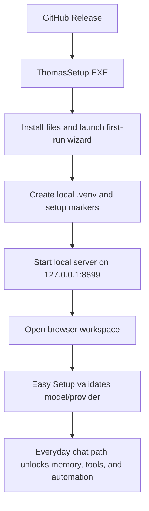
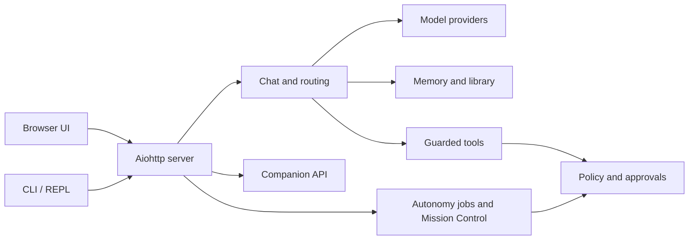
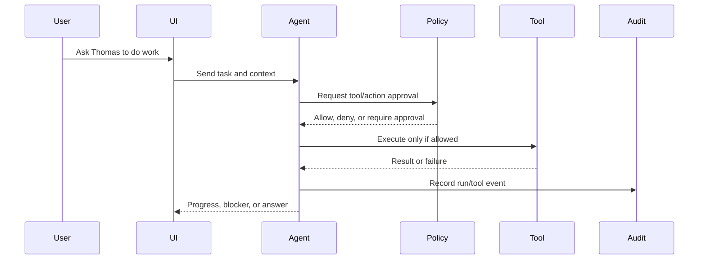
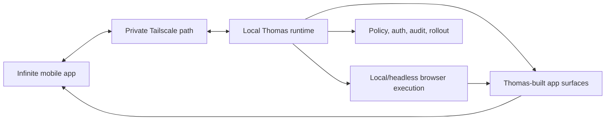

# Thomas Architecture Overview

This is the short public architecture map. It is intentionally higher-level than
the code so agents and contributors can orient before editing.

## Install And First Run

The installer and first-run path should be understandable to a non-engineer. If
the wizard fails, the support path is `support.cmd`, `repair.cmd`, `setup.cmd`,
and `bootdoctor.cmd`.

## Runtime Model

The public default is loopback-only. Remote or LAN use must be configured
intentionally and protected with the production controls documented in
`README.md`, `SECURITY.md`, and `docs/NETWORKING_AND_FIREWALL.md`.

## Guarded Execution

Guardrails are executable checks in the runtime, not just written instructions.
Docs still matter because agents and contributors need to know which checks exist
and which workflow is safe.

## Infinite App Direction

Infinite is planned as a mobile companion, not the Thomas runtime itself. Thomas
keeps execution, policy, and audit authority on the local host. Infinite renders
approved chat, approvals, dashboards, and app-like surfaces over a private
network path.

## Thomas OS Direction

Thomas OS is a long-horizon concept. It is not a current distribution, installer,
or supported runtime. The current concrete path is: make Thomas Core reliable,
build the Infinite companion app contract, then use that learning to define what
an OS-level environment should actually be.
