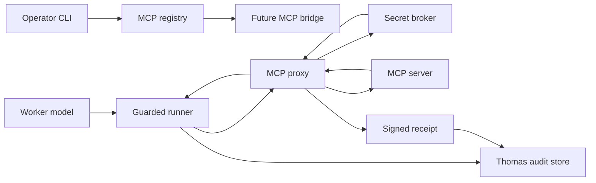

# CyberArk MCP Secret Proxy Threat Model

Date: 2026-06-27
Status: planning threat model for ranked Agentic AI item 16, "CyberArk Agent Guard Secrets And MCP Proxy"
Scope: one Thomas MCP/tool path: an operator registers an MCP server through the compatibility CLI, a future MCP bridge exposes the server as agent-callable tools, and secret material is retrieved through a proxy/broker with audit evidence instead of being passed directly in clear-text registry fields or tool arguments.

## Source Evidence Checked

- `plans/thomas/AGENTIC_AI_FEATURE_RANKINGS.md` ranks CyberArk Agent Guard Secrets And MCP Proxy at score 89 and calls for threat-modeling one Thomas MCP tool path plus a proxy-backed secret retrieval flow with audit evidence.
- `thomas/cli/compat_mcp.py` defines `thomas mcp add/list/get/remove/serve` compatibility commands and writes MCP server rows with `name`, `transport`, `command`, `args`, `url`, `env`, `enabled`, and timestamps.
- `thomas/cli/parity_support.py:mcp_registry_path`, `load_mcp_registry`, and `save_mcp_registry` persist MCP registry rows under the active Thomas data directory at `.thomas/cli/mcp_servers.json`.
- `thomas/agent/loop_core.py` initializes `_mcp_bridge`, while `thomas/agent/loop_execution.py` attempts to import `thomas.tools.mcp_bridge.register_mcp_tools` at run startup and disconnects the bridge at cleanup.
- `rg --files -g "*mcp*"` currently finds only `thomas/cli/compat_mcp.py`; the referenced `thomas.tools.mcp_bridge` module is not present in this checkout, so the runtime MCP bridge remains a future implementation seam for this model.
- `thomas/server/secrets.py:SecretStore` stores API secrets in memory plus optional persistence, uses Windows DPAPI when available, falls back to plaintext on non-Windows, and never exposes a list-all secret value API.
- `thomas/server/routes/secrets_aiohttp.py` exposes `/api/secrets`, `/api/secrets/reminders`, `POST /api/secrets/{profile}`, and `DELETE /api/secrets/{profile}` behind `require_api_access`, and returns metadata rather than clear-text keys.
- `thomas/agent/tool_risk.py` classifies `mcp.*`, `plugin.*`, `skill.install`, `tool.install`, and related tool-administration actions as high risk requiring allowlist, manual approval, and audit logging; secret-like arguments are critical and require deny-by-default, manual approval, secret isolation, output redaction, and audit logging.
- `thomas/agent/guarded_tools.py:GuardedToolRunner.run` evaluates policy before tool execution, emits approval events for sensitive tools, redacts arguments and results, and records policy/tool-result audit events when an audit store is configured.
- `plans/thomas/security/AIO_SANDBOX_WORKER_ISOLATION_THREAT_MODEL.md` and `plans/thomas/security/PIPELOCK_EGRESS_PROXY_THREAT_MODEL.md` establish the local planning convention for agent sandbox, MCP, network, proxy, and signed receipt controls.

## Executive Summary

The highest-risk Thomas MCP secret path is a worker-controlled or prompt-influenced MCP tool call obtaining a durable credential and sending it to a local or remote MCP server without an independent policy decision, a bounded secret class, or tamper-evident audit evidence. Thomas already has separate pieces that help: MCP registry metadata, server-side `SecretStore`, risk classification for `mcp.*` and secret-like actions, and a guarded tool runner with audit hooks. The missing control is the CyberArk-style broker/proxy boundary: MCP tools should receive task-scoped secret handles or ephemeral credentials only after a host-controlled proxy authorizes the request and records allow/deny evidence.

## Scope And Assumptions

In scope:

- `thomas mcp add` registry rows for `stdio`, `sse`, and `http` MCP servers.
- A future `thomas.tools.mcp_bridge` path that registers MCP server tools into the agent tool surface.
- Secret requests needed by one MCP tool call, such as a GitHub issue or repository operation.
- Policy decisions, secret class allow/deny behavior, audit fields, fail-closed behavior, and implementation acceptance criteria.

Out of scope:

- Implementing or fixing MCP runtime code in this slice.
- Full CyberArk Agent Guard integration, tenant onboarding, vault account lifecycle, or vendor-specific API calls.
- General browser/network egress policy already covered by the Pipelock threat model.
- Malicious human approval, OS compromise, or same-user shell access outside a future sandbox boundary.

Assumptions:

- MCP tool execution will eventually run outside the model's direct control but inside Thomas worker authority.
- Secrets needed by MCP tools may include GitHub tokens, provider API keys, gateway API keys, webhook URLs, OAuth access tokens, and local service credentials.
- The proxy/broker is a host-side or sidecar control point unavailable to the model, MCP server process, and worker shell.
- Secret delivery should prefer task-scoped handles or ephemeral credentials over raw long-lived values in environment variables.
- If the proxy, policy store, vault, signer, or audit sink is unavailable, MCP secret retrieval fails closed.

Open questions:

- Which external vault or local secure store should be authoritative for MCP secrets: CyberArk, Thomas `SecretStore`, OS credential storage, or a layered adapter?
- Should MCP server registration allow inline `--env KEY=VALUE` values at all, or only secret references such as `secret://github/repo_read`?
- Which future commit or run gate should require signed secret-retrieval receipts before accepting MCP-backed worker evidence?

## Chosen MCP Tool Path

This model uses a future GitHub-style MCP tool path because it is concrete and high value:

1. An operator registers a GitHub MCP server with `thomas mcp add github --transport stdio --command ...`.
2. The registry stores server metadata in `.thomas/cli/mcp_servers.json`.
3. At run startup, the future MCP bridge reads enabled registry rows and asks the proxy to start or connect to the server.
4. The agent emits an MCP tool call such as `mcp.github.issue_comment` or `mcp.github.repo_read`.
5. `GuardedToolRunner` evaluates policy for the MCP tool call, including task, claim, repository, and secret class.
6. The MCP proxy requests a credential from the secret broker using an identity-bound request, not raw worker-supplied text.
7. The broker returns a scoped handle or ephemeral credential only if the tool, task, target repo, and secret class are allowed.
8. The proxy injects the credential into the MCP request transport or server process and strips it from tool output.
9. Thomas records the policy decision, secret decision, MCP request metadata, result class, and signed receipt IDs.

## System Model

### Primary Components

- MCP registry CLI: `thomas/cli/compat_mcp.py` writes local MCP server configuration.
- Registry persistence: `thomas/cli/parity_support.py` persists `.thomas/cli/mcp_servers.json`.
- Future MCP bridge: `thomas/agent/loop_execution.py` references `thomas.tools.mcp_bridge.register_mcp_tools`, but the module is absent in this checkout.
- Guarded tool runner: `thomas/agent/guarded_tools.py` applies policy, approval, redaction, and audit events.
- Tool risk classifier: `thomas/agent/tool_risk.py` marks MCP/tool administration as high risk and secret-like access as critical.
- Current secret store: `thomas/server/secrets.py` persists local model/API secrets with DPAPI on Windows and plaintext fallback elsewhere.
- Secret management API: `thomas/server/routes/secrets_aiohttp.py` manages profile secrets behind API access checks without returning clear-text keys.
- Proposed MCP proxy and secret broker: future host-controlled boundary that mediates MCP server startup, tool calls, credential retrieval, injection, redaction, and receipts.

### Data Flows And Trust Boundaries

| Boundary | Data crossing | Channel | Current controls | Required proxy decision point |
|---|---|---|---|---|
| Operator -> MCP registry | Server name, transport, command, args, URL, `env` map | CLI JSON state write | Basic required-field validation; no secret-reference schema | Reject raw secret values; require secret refs, server allowlist, and registry receipt |
| Registry -> future bridge | Enabled MCP server rows | Local JSON file | Registry loader returns dict rows; missing bridge means no runtime enforcement yet | Validate registry digest, allowed transports, command path, URL policy, and env refs before launch |
| Agent -> guarded runner | MCP tool name, arguments, run/session/tool IDs | In-process tool call JSON | Policy/audit runner can deny, request approval, redact, and audit | Classify `mcp.*` plus target resource and required secret class before proxy call |
| Guarded runner -> MCP proxy | Tool call envelope, task/claim identity, secret class request | Local IPC or loopback HTTP | Future seam only | Authorize tool, target, requested scopes, and secret need; deny unknown tools by default |
| MCP proxy -> secret broker | Worker identity, tool name, target resource, secret ref, requested scope | Local broker API or vault API | Current `SecretStore.get(profile)` is direct in-process lookup for model profiles | Return only handle or ephemeral secret; never disclose unrelated profiles or raw long-lived secrets |
| MCP proxy -> MCP server | Tool request plus injected credential or token handle | stdio, HTTP, or SSE | Registry supports all three transport types | Strip credentials from logs/results; enforce per-tool target and byte limits |
| MCP proxy -> audit store | Decision receipt, redacted args hash, secret class, result class | Append-only audit event | Guarded runner can log policy/tool-result events | Signed allow/deny/error receipt, proxy config digest, secret policy digest |

### Diagram

## Assets And Security Objectives

| Asset | Why it matters | Security objective |
|---|---|---|
| Long-lived API keys and OAuth refresh tokens | A leaked credential can outlive one worker run and grant broad external access | Confidentiality |
| Ephemeral access tokens | Short-lived tokens still authorize real actions during the task window | Confidentiality, Integrity |
| MCP registry rows | Registry command, URL, args, and env fields decide what code or service receives tool authority | Integrity |
| Secret policy | Maps task, worker identity, tool, target resource, and allowed secret class | Integrity |
| MCP proxy decisions | Determines whether a tool call receives a credential or is denied | Integrity |
| Audit receipts | Future review and gates depend on tamper-evident proof of what was requested and allowed | Integrity, Availability |
| Tool results | MCP output influences worker decisions, file edits, and external actions | Integrity |
| Thomas local state | `.thomas` state includes registry files, token metadata, audit stores, and secret persistence | Confidentiality, Integrity |

## Secret Request Lifecycle

1. Register: Operator adds an MCP server using secret references, not raw credential values.
2. Resolve server: Future bridge asks the MCP proxy to validate the registry row before launch or connection.
3. Classify tool: Guarded runner labels the MCP tool and requested target as tool-admin, network, file, or secret-sensitive.
4. Request secret: Proxy sends `worker_id`, `run_id`, `tool_call_id`, `mcp_server`, `tool_name`, `target_resource`, `secret_ref`, and requested scopes to the broker.
5. Decide: Broker checks task claim, allowlist, secret class, expiry, approval state, and target binding.
6. Deliver: Broker returns `deny`, a non-exportable handle, or an ephemeral credential with narrow scope and TTL.
7. Inject: Proxy supplies the credential only to the approved MCP request path.
8. Redact: Proxy and guarded runner strip secret material from MCP stdout/stderr, HTTP traces, tool results, and audit payloads.
9. Revoke: Broker revokes or expires ephemeral credentials after the tool call or run.
10. Evidence: Proxy emits signed receipts for registration validation, secret allow/deny, MCP request, MCP result, and revocation.

## Proxy Decision Points

| Decision | Inputs | Allow condition | Deny condition |
|---|---|---|---|
| Registry validation | Server name, command/URL, transport, env refs | Registered server is on allowlist; transport and command/URL match policy | Unknown server, raw secret-looking env value, unapproved command path, unsafe remote URL |
| Tool exposure | Server tools, tool names, descriptions, schemas | Tool names and schemas match pinned manifest digest | Tool list changes unexpectedly, schema asks for secret args, unsupported dynamic tools |
| Secret class | Tool name, target resource, requested scope | Secret class is explicitly allowed for this task and target | Broad token requested for narrow task; secret class absent from policy |
| Identity binding | Worker ID, run ID, task ID, claim scope | Active run and claim match request context | Missing or mismatched task/claim/run identity |
| Approval | Risk classification, policy result, human/native auth state | Required approval is present and bound to this request | Approval absent, stale, or for different tool/target |
| Secret delivery mode | Transport, MCP server trust level | Handle or ephemeral token can satisfy call | Long-lived raw secret would be exposed to untrusted process |
| Result release | MCP output, stdout/stderr, error text | Output contains no secret material and matches expected schema | Secret-like output, oversized result, unexpected file/network side effects |

## Allowed And Denied Secret Classes

Allowed only with explicit task policy:

- Read-only repository token for a named repository and run.
- Issue/comment token scoped to one tracker or repository when the task requires posting evidence.
- Short-lived model gateway token for a named provider profile and tool call.
- Webhook URL token for one approved notification destination.
- Local development service token for an explicit localhost port and task.
- Secret handle whose raw value never leaves the broker/proxy process.

Denied by default:

- Broad personal access tokens, organization owner tokens, admin tokens, and cloud root credentials.
- OAuth refresh tokens passed directly to MCP servers.
- SSH private keys, signing keys, runtime protection keys, and commit/publish keys.
- Raw `.env` file contents, unbounded environment forwarding, or full process environment snapshots.
- Secrets requested by model-supplied tool arguments rather than policy-bound secret references.
- Secrets for a different task, claim scope, repository, provider profile, or user identity.
- Any secret request from an unregistered MCP server, changed tool manifest, disabled server row, or failed proxy validation.

## Audit Evidence Fields

| Field | Purpose |
|---|---|
| `receipt_version` | Enables schema evolution. |
| `receipt_id` | Stable reference for audit rows and final worker reports. |
| `issued_at` | UTC timestamp from the proxy or signer. |
| `run_id`, `session_id`, `tool_call_id`, `worker_id` | Joins evidence to Thomas execution. |
| `task_id`, `claim_scope` | Binds the request to approved workboard scope. |
| `mcp_server_name`, `server_manifest_digest`, `transport` | Identifies the target MCP server and pinned tool surface. |
| `tool_name`, `tool_schema_digest`, `tool_risk_category` | Records the MCP operation being authorized. |
| `target_resource` | Repo, issue, URL, channel, profile, or service being accessed. |
| `secret_ref`, `secret_class`, `requested_scopes` | Describes requested secret authority without storing the value. |
| `delivery_mode` | `handle`, `ephemeral_token`, `env_injection`, or `deny`. |
| `ttl_seconds`, `expires_at`, `revocation_id` | Supports expiry and revocation review. |
| `decision`, `reason_code`, `reason_detail` | Human-readable allow/deny/error explanation. |
| `approval_id`, `approval_source` | Links manual/native auth where required. |
| `args_hash`, `result_hash`, `stdout_stderr_hash` | Verifies content classes without persisting secrets. |
| `redaction_result` | Records whether output scanning found or removed sensitive text. |
| `proxy_instance_id`, `proxy_config_digest`, `policy_digest` | Identifies enforcing code and policy versions. |
| `signing_key_id`, `signature_alg`, `signature` | Verifies receipt authenticity. |

Never persist raw secret values, authorization headers, cookies, OAuth refresh tokens, full stdout/stderr, or full MCP request bodies in receipts. Store hashes, classes, or redacted previews only.

## Top Abuse Paths

1. Prompt injection steers the worker to call `mcp.github.repo_read` with a model-supplied `GITHUB_TOKEN`; the proxy rejects model-supplied secret material and requires a policy-bound secret ref.
2. Operator registers an MCP server with `--env GITHUB_TOKEN=<real token>`; registry validation blocks raw secret-looking env values and requires a broker reference.
3. A malicious MCP server advertises a new `secret.dump` or `repo.admin` tool after initial registration; manifest digest mismatch prevents tool exposure.
4. A compromised MCP server prints the injected credential to stdout; proxy output scanning redacts the value, records a leak attempt, and returns a denied result class.
5. A worker asks for an organization-wide token to comment on one issue; the broker grants only an issue-scoped ephemeral credential or denies if narrowing is impossible.
6. The secret broker or signer is unavailable; MCP secret retrieval returns `error_fail_closed`, and the tool call is not executed with cached or fallback credentials.
7. Worker fabricates a receipt claiming secret approval; future verification rejects it because the signature, policy digest, or run/tool identity does not match.
8. A stale receipt from a previous run is replayed; the proxy rejects it because `run_id`, `tool_call_id`, `expires_at`, and `server_manifest_digest` are bound to the original decision.

## Threat Model Table

| Threat ID | Threat source | Prerequisites | Threat action | Impact | Impacted assets | Existing controls (evidence) | Gaps | Recommended mitigations | Detection ideas | Likelihood | Impact severity | Priority |
|---|---|---|---|---|---|---|---|---|---|---|---|---|
| TM-001 | Prompt-influenced worker | MCP tool can request or receive secrets; worker sees untrusted content | Requests a broad secret and forwards it to an MCP server | Durable credential theft and external account compromise | API keys, OAuth tokens, repo tokens | `tool_risk.py` treats secret-like access as critical; `guarded_tools.py` evaluates policy before execution | No MCP secret broker or bridge enforcement exists yet | Secret broker must authorize by task, tool, target, and secret class; deny model-supplied secret values | Signed deny/allow receipts; alert on secret-like args in MCP calls | Medium | High | High |
| TM-002 | Malicious or compromised MCP server | Server is registered or tool manifest changes after review | Exposes unexpected tool or asks for credential-bearing args | Tool authority expands silently | MCP registry, tool results, secrets | `compat_mcp.py` stores server metadata; `tool_risk.py` marks `mcp.*` as high-risk tool admin | No pinned manifest or runtime bridge present | Pin server/tool manifest digest; require approval on drift; disable dynamic tools by default | Manifest drift receipts; registry diff alerts | Medium | High | High |
| TM-003 | Operator mistake or poisoned setup docs | Inline env values are accepted during `thomas mcp add` | Stores raw secrets in `.thomas/cli/mcp_servers.json` | Local state leak and accidental commit/report exposure | MCP registry, local secrets | `mask_secret` exists for display in parity helpers; `SecretStore` can persist secrets separately | MCP registry accepts arbitrary env map values | Reject secret-looking env values; support `secret://` references; migrate existing raw values to broker refs | Registry scanner for token patterns; deny receipt on raw secret fields | High | Medium | High |
| TM-004 | Proxy or vault outage | MCP tool needs a secret during degraded state | Falls back to cached, config, env, or plaintext credential | Fail-open secret disclosure or unauthorized action | Secret policy, credentials, audit receipts | Current `SecretStore` can return a value when called directly | No fail-closed MCP secret retrieval contract yet | Make proxy, policy, signer, and broker availability mandatory for secret-bearing MCP calls | `error_fail_closed` receipts; operator alert on broker outage | Medium | High | High |
| TM-005 | Same-worker or local process attacker | Worker can edit audit artifacts or print fake JSON | Forges a secret allow receipt to satisfy future gates | Trust in evidence collapses | Audit receipts, commit gates | Guarded runner can write audit events when configured | Existing audit events are not signed secret receipts | Sign receipts with host-held key; verify signature, run ID, tool ID, policy digest, and expiry | Receipt verification failure metric; gate blocks on unsigned receipts | Low | High | High |
| TM-006 | MCP server output channel | Server receives credential or handle and can write stdout/stderr | Echoes secret material in tool output or error | Secret leaks into model context, logs, or final report | Tool results, audit logs, model context | `guarded_tools.py` redacts result objects through policy redactor | MCP-specific stdout/stderr redaction and leak classification are not defined | Proxy scans and redacts server output; terminate server on leak attempt; never pass raw secret where handle works | Secret-pattern redaction events; leak-attempt receipt | Medium | High | High |
| TM-007 | Overbroad policy author | Task policy allows too broad a secret class | Grants repo/admin or multi-service credential for narrow work | Unnecessary blast radius on worker or server compromise | External systems, user accounts | Server secrets API has per-profile metadata and rotation reminders | No target-bound MCP secret classes yet | Define allowed/denied classes; prefer least-privilege ephemeral credentials and target resource binding | Receipt query for broad scopes; periodic policy review | Medium | Medium | Medium |
| TM-008 | Registry tampering | Local MCP registry file is edited outside CLI | Enables disabled server or swaps command/URL | Tool execution goes to attacker process | Registry integrity, MCP traffic | Registry persists JSON under data dir | No signed registry digest or owner validation | Validate registry digest at run start; require approval for changed server rows; record registry receipt | Registry digest mismatch alert | Medium | Medium | Medium |

## Criticality Calibration

Critical:

- A worker or MCP server can retrieve raw long-lived secrets without proxy authorization.
- MCP secret retrieval fails open when the broker, policy store, or signer is unavailable.
- Receipt verification can be bypassed for secret-bearing MCP actions that influence commits or external systems.

High:

- Raw secret values can be stored in MCP registry env fields.
- MCP tool manifest drift can expose unreviewed tools with existing credentials.
- Secret material can leak through MCP stdout, stderr, or tool result text into model context.

Medium:

- A task policy grants broader scopes than needed but still requires proxy authorization and audit.
- Registry tampering is detectable after the fact but not blocked before launch.
- Audit evidence is complete but not yet tied to commit/run acceptance gates.

Low:

- A denied secret request produces noisy but non-sensitive logs.
- An MCP server registration fails validation because the allowlist is missing a legitimate server.
- Rotation metadata is stale for a secret class that cannot currently be delivered to MCP tools.

## Focus Paths For Security Review

| Path | Why it matters | Related Threat IDs |
|---|---|---|
| `thomas/cli/compat_mcp.py` | Accepts MCP registry inputs, including env fields that could carry raw secrets. | TM-002, TM-003, TM-008 |
| `thomas/cli/parity_support.py` | Defines MCP registry path, JSON persistence, and masking helpers used by compatibility commands. | TM-003, TM-008 |
| `thomas/agent/loop_execution.py` | Contains the future bridge import seam where MCP tools would enter runtime execution. | TM-001, TM-002, TM-004 |
| `thomas/agent/loop_core.py` | Holds `_mcp_bridge` lifecycle state for the agent loop. | TM-002, TM-004 |
| `thomas/agent/guarded_tools.py` | Current policy, approval, redaction, and audit boundary for tool execution. | TM-001, TM-005, TM-006 |
| `thomas/agent/tool_risk.py` | Existing deterministic tool and secret risk classification. | TM-001, TM-002, TM-007 |
| `thomas/server/secrets.py` | Current secret storage implementation and persistence behavior. | TM-001, TM-004, TM-007 |
| `thomas/server/routes/secrets_aiohttp.py` | Current secret management API and clear-text key avoidance behavior. | TM-001, TM-004, TM-007 |
| `plans/thomas/security/PIPELOCK_EGRESS_PROXY_THREAT_MODEL.md` | Related proxy receipt model for network/browser paths; should stay consistent with MCP receipt fields. | TM-004, TM-005 |
| `plans/thomas/security/AIO_SANDBOX_WORKER_ISOLATION_THREAT_MODEL.md` | Related sandbox and MCP isolation assumptions; same-user shell bypass is a residual risk. | TM-001, TM-005, TM-006 |

## Failure Modes And Fail-Closed Behavior

| Failure mode | Required behavior | Evidence to collect |
|---|---|---|
| Missing MCP bridge module | Do not expose MCP tools; report bridge unavailable | Startup diagnostic and no MCP tools registered |
| Registry row contains raw secret-looking env value | Refuse to launch/register server for secret-bearing use | Deny receipt with field name and redacted fingerprint |
| Unknown or changed MCP server manifest | Do not expose changed tools | Manifest mismatch receipt and operator-visible approval request |
| Secret broker unavailable | Deny secret-bearing MCP call | `error_fail_closed` receipt; no fallback to env/config |
| Signer unavailable | Deny allow decisions for secret retrieval | Tool error and signer-unavailable audit event |
| Audit store unavailable | Deny high-risk secret retrieval or write to host-owned spool before allowing | Spool hash or fail-closed error |
| MCP server emits secret-like output | Redact output, mark result unsafe, and stop returning raw server text | Leak-attempt receipt and redaction summary |
| Approval timeout | Deny request without invoking MCP server | Approval timeout event bound to tool call |
| Receipt verification fails | Treat secret evidence as absent; future gate blocks | Verification error with receipt ID and signing key ID |

## Implementation Acceptance Checklist

- [ ] Add a real MCP bridge path only after registry validation, tool manifest pinning, and guarded runner integration are defined.
- [ ] Reject raw secret-looking values in MCP registry `env` fields; accept only secret references or non-sensitive configuration.
- [ ] Define a `secret_ref` schema that includes secret class, target resource, allowed scopes, TTL, and owner.
- [ ] Require the MCP proxy to authorize every secret-bearing MCP call by run, worker, task, claim, tool, target, and policy digest.
- [ ] Prefer non-exportable handles or short-lived scoped credentials over raw long-lived secrets.
- [ ] Make proxy, broker, policy, signer, and audit availability fail closed for secret-bearing MCP calls.
- [ ] Emit signed receipts for registry validation, tool exposure, secret allow/deny, MCP request, MCP result, redaction, and revocation.
- [ ] Store receipt IDs in Thomas tool-result/audit events with `run_id`, `session_id`, and `tool_call_id`.
- [ ] Redact or hash MCP args, stdout, stderr, headers, and results before audit persistence.
- [ ] Add focused tests for raw registry secret rejection, manifest drift denial, broker-unavailable fail closed, forged receipt rejection, output-secret redaction, and narrow-scope allow.
- [ ] Require future MCP-backed worker reports to include receipt IDs and verification results when external secrets were used.

## Residual Risks

- MCP runtime support is not present in this checkout, so this is a pre-implementation threat model rather than validation of a live tool path.
- Thomas's current `SecretStore` is useful for local model/API profile secrets, but non-Windows plaintext persistence is not enough for broad MCP secret authority.
- Same-user shell access can still read local state or bypass local-only controls unless future worker isolation blocks direct filesystem and network access.
- A proxy can prove that secret retrieval was authorized, but it cannot prove the remote MCP server behaved honestly unless tool outputs and side effects are independently checked.
- Overly broad human-approved policy remains a governance risk; least-privilege secret classes and receipt review need to be part of the future implementation gate.
