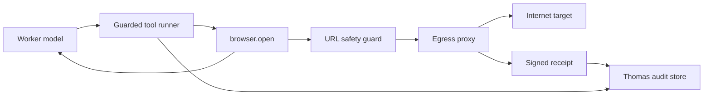

# Pipelock Egress Proxy Threat Model

Date: 2026-06-27
Status: planning threat model for ranked Agentic AI item 14, "Pipelock AI Agent Firewall"
Scope: one Thomas worker browser/tool-call path: an agent invokes `browser.open` for a model- or user-supplied URL, Thomas mediates the navigation through an egress proxy decision point, and the run records a signed action receipt.

## Source Evidence Checked

- `plans/thomas/AGENTIC_AI_FEATURE_RANKINGS.md:138` through `plans/thomas/AGENTIC_AI_FEATURE_RANKINGS.md:145` ranks Pipelock AI Agent Firewall at score 89 and calls for threat-modeling one Thomas browser/tool-call path through an egress proxy and signed receipt flow.
- `thomas/tools/browser.py:578` through `thomas/tools/browser.py:594` define `browser.open` as a browser-category tool that accepts a required URL and returns page title plus cleaned page text.
- `thomas/tools/browser.py:597` through `thomas/tools/browser.py:611` normalize the target URL and run `check_outbound_url` before opening a Playwright page or navigating.
- `thomas/tools/browser.py:624` through `thomas/tools/browser.py:632` re-check the final response URL after navigation so redirects to blocked hosts fail closed before content is returned.
- `thomas/tools/url_safety.py:1` through `thomas/tools/url_safety.py:23` document the canonical outbound URL guard for model- or user-supplied URLs, including cloud metadata, link-local, private network, loopback, and DNS-resolution checks.
- `thomas/tools/url_safety.py:96` through `thomas/tools/url_safety.py:143` implement the guard: only HTTP(S), no embedded credentials, block/allow host rules, private-host policy, literal IP checks, and best-effort DNS checks.
- `thomas/tools/http_client.py:174` through `thomas/tools/http_client.py:180` apply the same SSRF policy before direct HTTP requests, and `thomas/tools/http_client.py:222` through `thomas/tools/http_client.py:232` disable automatic redirect following to avoid redirect-based SSRF.
- `thomas/agent/tool_risk.py:155` through `thomas/agent/tool_risk.py:178` classify network and browser automation actions as requiring host policy, path sandboxing, redaction, rate limiting, and audit logging.
- `thomas/agent/guarded_tools.py:93` through `thomas/agent/guarded_tools.py:119` evaluate tool policy and log a redacted policy decision before execution when an audit store exists.
- `thomas/agent/guarded_tools.py:121` through `thomas/agent/guarded_tools.py:137` fail denied tool calls without invoking the executor, and `thomas/agent/guarded_tools.py:285` through `thomas/agent/guarded_tools.py:296` audit executed tool results.
- `thomas/server/app_core.py:223` through `thomas/server/app_core.py:236` create an optional durable action audit log at `.thomas/audit.sqlite3`.
- `thomas/server/app_core.py:275` through `thomas/server/app_core.py:343` wires guardrails policy, approval broker, redaction, audit, and the guarded runner into the server.
- `thomas/server/audit_log.py:29` through `thomas/server/audit_log.py:47` define the current audit event schema, and `thomas/server/audit_log.py:52` through `thomas/server/audit_log.py:79` redact and persist audit events.

## Executive Summary

The highest-risk path is an untrusted page or prompt steering a Thomas worker into a browser navigation or HTTP request that reaches cloud metadata, internal services, localhost admin ports, credential-bearing URLs, or a malicious MCP/tool endpoint. Thomas already has an in-process SSRF guard for `browser.open` and direct HTTP requests, plus policy/audit hooks around guarded tools. A Pipelock-style egress proxy should turn those in-process checks into an out-of-process fail-closed control point that records signed receipts for every allow, deny, redirect, and proxy failure.

## Scope And Assumptions

In scope:

- `browser.open` with a user/model supplied URL and its direct HTTP sibling behavior.
- HTTP and HTTPS browser navigation, redirects, DNS decisions, and response metadata needed for receipt generation.
- Thomas guardrails policy, action audit, tool-risk classification, and future signed receipt evidence.
- One worker run with `run_id`, `session_id`, `tool_call_id`, `tool_name`, and a declared task/claim scope.

Out of scope:

- Full MCP gateway implementation, A2A protocol mediation, WebSocket frame policy, and package-manager egress.
- Browser renderer sandbox escape, Playwright implementation bugs, kernel compromise, or malicious human approval.
- Changing runtime code in this slice.

Assumptions:

- The egress proxy is a host-side or sidecar control point outside the worker model's direct control.
- Thomas will keep the existing URL guard as defense in depth but will not rely on it as the only network boundary.
- Signed receipts can be HMAC or asymmetric signatures; the signing key is unavailable to the worker and browser process.
- If the proxy, policy store, signer, or audit sink is unavailable, browser/network egress fails closed.
- Private-network access remains possible only through an explicit per-task policy, not through the current local-first default alone.

Open questions:

- Which signer should own receipts: local host key, Thomas install key, or remote policy service key?
- Should localhost/private-network access be globally denied for all agent workers, or allowed only for named development ports in task policy?
- Should receipt verification become a commit gate for browser/network-enabled worker runs?

## System Model

### Chosen Path

1. A worker receives a prompt or task context containing a URL.
2. The agent emits a `browser.open` tool call with `url`.
3. Thomas guardrails evaluate the tool call and log a policy decision.
4. `browser.open` normalizes the URL and calls the outbound URL policy before navigation.
5. The egress proxy evaluates DNS, scheme, host, destination IP, method, request metadata, and task policy.
6. The proxy allows, denies, or challenges the request and emits a signed receipt.
7. Playwright navigates only on allow.
8. Redirect destinations are re-evaluated before content is returned.
9. Thomas records tool result, receipt reference, and any failure or denial.

### Data Flows And Trust Boundaries

| Boundary | Data crossing | Channel | Existing controls | Pipelock decision point |
|---|---|---|---|---|
| Worker prompt -> tool call | URL, session name, wait selector | In-process tool call JSON | Tool schema requires URL; tool-risk classifies browser actions as medium risk | Validate URL intent, task scope, and policy profile before any network attempt |
| Guarded runner -> browser tool | Redacted args, run/session/tool IDs, policy decision | Python call | Policy decision logged before execution; denies return without executor call | Receipt should include policy decision ID and redacted args hash |
| Browser tool -> egress proxy | Destination URL, DNS target, method, redirect chain | HTTP(S) proxy or browser network hook | Current in-process `check_outbound_url` before and after redirect | Proxy is authoritative allow/deny point; in-process guard is defense in depth |
| Egress proxy -> Internet or private network | HTTP(S) request, headers, body size, response metadata | Network | URL guard blocks metadata/link-local and policy-blocked hosts | Default deny private/internal/metadata; allow only task policy classes |
| Egress proxy -> audit store | Decision, reason, hashes, signer metadata | Append-only event write | Existing audit schema records policy/tool events but not signed egress receipts | Signed receipt with canonical fields and verification material |
| Tool result -> worker/model | Page URL, title, cleaned text, error | Tool result event | Redirect re-check and redaction through guarded runner | Result must carry receipt ID, not raw secrets or unredacted headers |

### Diagram

## Assets And Security Objectives

| Asset | Why it matters | Security objective |
|---|---|---|
| Cloud and local credentials | Metadata endpoints, localhost services, tokens, cookies, and headers can expose durable privileges | Confidentiality |
| User files and local services | Browser or HTTP access to localhost/private networks can read or mutate non-Thomas state | Confidentiality, Integrity |
| Thomas run integrity | Tool results influence worker decisions, commits, and follow-up automation | Integrity |
| Egress policy | A fail-open policy bypass converts the proxy into logging-only theater | Integrity, Availability |
| Signed receipts | Future gates need tamper-evident proof of allowed and denied egress | Integrity |
| Audit store | Security review depends on durable, redacted, queryable evidence | Integrity, Availability |
| Browser session state | Cookies, downloads, storage, and redirects can carry sensitive or attacker-controlled data | Confidentiality, Integrity |

## Allowed And Denied Traffic Classes

Allowed only with explicit task policy:

- Public HTTP(S) hosts required by the task, optionally pinned by exact host or suffix.
- Search provider endpoints already configured in Thomas when the worker task requires web research.
- Package registries or repository hosts named in the task, with method and byte limits.
- Local development endpoints only when the task explicitly names the port and purpose.

Denied by default:

- Cloud metadata and link-local addresses, including `169.254.0.0/16`.
- Loopback, `.localhost`, `.local`, RFC1918/private networks, and reserved or multicast IPs unless explicitly allowed.
- URLs with embedded credentials.
- Non-HTTP(S) schemes for this browser path.
- Redirects from allowed public hosts to denied hosts.
- Requests with unapproved credential headers, cookies, or secret-looking query parameters.
- WebSocket, MCP, A2A, package-manager, and direct socket traffic for this slice unless a separate policy covers them.
- Proxy bypass attempts, direct DNS-over-HTTPS clients, alternate browser profiles, or custom CA injection.

## Signed Receipt Fields

Minimum receipt fields for one `browser.open` decision:

| Field | Purpose |
|---|---|
| `receipt_version` | Enables schema evolution. |
| `receipt_id` | Stable reference stored in tool result and audit rows. |
| `issued_at` | UTC timestamp from the signer host. |
| `run_id`, `session_id`, `tool_call_id`, `worker_id` | Joins receipt to Thomas run evidence. |
| `tool_name`, `tool_category` | Records `browser.open` and browser/network risk class. |
| `task_id`, `claim_scope`, `policy_profile_id` | Binds decision to the authorized task context. |
| `request_url_hash`, `normalized_url`, `scheme`, `host`, `port` | Captures destination without storing unnecessary secrets. |
| `resolved_ips` | Records DNS result used for the decision. |
| `method`, `request_headers_hash`, `body_bytes` | Captures request class without leaking content. |
| `redirect_from_receipt_id` | Chains redirect decisions. |
| `decision` | `allow`, `deny`, `challenge`, or `error_fail_closed`. |
| `reason_code`, `reason_detail` | Human-reviewable policy explanation. |
| `response_status`, `response_bytes`, `content_type` | Response metadata for allowed requests. |
| `in_process_guard_result` | Records whether the existing Thomas URL guard agreed. |
| `proxy_instance_id`, `proxy_config_digest` | Identifies the enforcing proxy and policy build. |
| `signing_key_id`, `signature_alg`, `signature` | Verifies receipt authenticity. |

Do not store raw authorization headers, cookies, page text, full bodies, or secret-bearing query strings in the receipt. Store hashes or redacted previews only.

## Primary Threats

| Threat | Abuse path | Impact | Likelihood | Priority | Required mitigation |
|---|---|---:|---:|---:|---|
| Metadata credential theft | Prompt-injected page or model directs `browser.open` to cloud metadata or link-local host | High | Medium | High | Proxy-level block independent of in-process guard; signed deny receipt |
| Internal service SSRF | Public URL redirects to localhost/private admin service | High | Medium | High | Re-evaluate every redirect hop; deny private targets by default |
| DNS rebinding gap | Host resolves public at check time and private at connect time | High | Medium | High | Proxy performs resolution and connect decision atomically or pins resolved IP per connection |
| Policy fail-open | Proxy, signer, or policy store is unavailable and browser falls back to direct network | High | Medium | High | Browser/network egress requires proxy; unavailable proxy returns `error_fail_closed` |
| Receipt forgery | Worker writes fake allow receipts or edits audit rows to pass future gates | High | Low | High | Sign receipts with host-held key; commit gates verify signature and config digest |
| Secret header leakage | Tool args or browser profile sends cookies/tokens to attacker host | High | Medium | High | Strip or block credential headers unless policy allows; empty worker browser profile |
| Audit poisoning | Attacker controls URL/error text that corrupts logs or dashboards | Medium | Medium | Medium | Structured schema, escaping, length caps, redaction, raw-log quarantine |
| Traffic-class bypass | Worker uses `http.client`, MCP, WebSocket, package manager, or shell to avoid browser proxy | High | Medium | High | One egress layer for all network-capable tools; deny direct sockets from worker sandbox |
| Overbroad private allow | Local-first defaults permit private networks for convenience during autonomous runs | Medium | High | High | Per-task allowlist; private allow requires explicit policy reason and receipt |
| Receipt replay | Old allow receipt is reused for a different run, host, or policy version | Medium | Low | Medium | Include run/tool/policy/config digest and timestamp; reject stale or mismatched receipts |

## Failure Modes And Fail-Closed Behavior

| Failure mode | Required behavior | Evidence to collect |
|---|---|---|
| Proxy process unavailable | Deny network attempt; do not call browser direct network | `error_fail_closed` receipt if signer available; local tool error if not |
| Policy file unreadable or invalid | Deny all egress for the run | Policy load error, config digest failure, operator-visible alert |
| Signer unavailable | Deny allow decisions; optionally emit unsigned local diagnostic marked non-authoritative | Tool result error and audit event saying receipt signing unavailable |
| DNS resolution fails | Deny unless policy explicitly allows unresolved host class, which this slice should not | Resolver error and host |
| Redirect to denied target | Abort navigation before returning page text | Parent receipt ID and denied redirect receipt |
| In-process guard and proxy disagree | Deny and flag policy drift | Both decisions, guard version, proxy config digest |
| Audit store unavailable | Deny high-risk egress or write to a host-owned spool before allowing | Spool path/hash or fail-closed error |
| Receipt signature verification fails | Treat receipt as absent; future commit gate blocks network-enabled claim | Verification error, receipt ID, signing key ID |

## Abuse Paths

1. Attacker places instructions on a webpage telling the model to browse `http://169.254.169.254/latest/meta-data/`; the proxy blocks the link-local target and records a signed deny receipt.
2. Attacker gives a benign public URL that returns `302 Location: http://127.0.0.1:...`; the proxy re-evaluates the redirect and denies before browser content is exposed.
3. A malicious DNS record points to a public IP during in-process validation and a private IP during connection; the proxy owns DNS plus connect and blocks private resolution at the decision point.
4. The worker tries to use `http.client` or MCP instead of `browser.open`; the same egress policy applies by category and denies direct network paths without a receipt.
5. The proxy crashes and Playwright would normally connect directly; Thomas refuses the tool call because receipt-backed egress is mandatory for browser/network-enabled runs.
6. Worker output includes a fabricated JSON receipt; host verification rejects it because the signature, run ID, tool call ID, or proxy config digest does not match.
7. A task legitimately needs `localhost:3000`; policy allows only that host/port for that run, receipts record the exception, and all other private destinations remain denied.

## Implementation Checklist

- [ ] Route `browser.open` network traffic through a host-controlled egress proxy or browser network hook that the worker cannot bypass.
- [ ] Keep `thomas.tools.url_safety.check_url` as a defense-in-depth pre-check and redirect re-check.
- [ ] Make proxy availability, policy load, signer availability, and audit persistence fail closed for browser/network egress.
- [ ] Define a task-scoped egress policy with allowed hosts, denied hosts, private-network posture, methods, byte limits, and redirect rules.
- [ ] Emit a signed receipt for every allow, deny, redirect deny, challenge, and proxy error.
- [ ] Store receipt IDs in Thomas tool-result/audit events alongside `run_id`, `session_id`, and `tool_call_id`.
- [ ] Redact or hash headers, cookies, bodies, and query parameters before audit persistence.
- [ ] Use a host-held signing key unavailable to worker code, browser code, MCP servers, and sandbox shell.
- [ ] Verify receipt signatures and policy/config digests before accepting network-enabled worker evidence.
- [ ] Add regression coverage for metadata IP denial, localhost denial, redirect-to-private denial, proxy-unavailable fail closed, forged receipt rejection, and explicit localhost allow.
- [ ] Extend the same egress decision layer to `http.client`, web fetch/extract, MCP, WebSocket, package-manager, and shell/network-capable tools before marking Pipelock integration complete.

## Future Acceptance Criteria

- [ ] A `browser.open` call to `http://169.254.169.254/` produces no network connection and records a signed deny receipt.
- [ ] A public URL that redirects to localhost/private/link-local is denied at the redirect hop with a chained receipt.
- [ ] A permitted public URL records a signed allow receipt with normalized destination, resolved IP, status, byte count, and proxy config digest.
- [ ] If the proxy, signer, or policy store is stopped, `browser.open` returns a fail-closed tool error.
- [ ] A forged or replayed receipt fails host verification.
- [ ] A task-specific private-network exception is narrow to host, port, method, and run, and is visible in audit.
- [ ] No raw cookies, authorization headers, or page bodies are persisted in receipt rows.
- [ ] The final worker report for any network-enabled implementation includes receipt IDs and verification command results.

## Residual Risks

- An in-process URL guard can drift from proxy behavior; the proxy must be authoritative and drift should block egress.
- Local-first Thomas tasks sometimes need localhost or private-network targets. Those exceptions are high-risk and should be rare, explicit, and visible.
- Browser engines can make secondary requests for subresources. The proxy must mediate subresource requests, not only the top-level URL.
- A same-user shell outside a sandbox can bypass local-only controls. This threat model assumes future worker egress is coupled with worker isolation so direct sockets are not available.
- Receipt signing proves what the proxy decided, not that the remote content was safe. Content handling and prompt-injection defenses remain separate controls.
